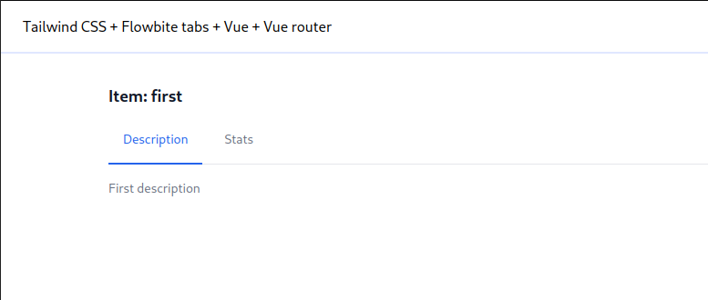

# Deprecated

I finally implemented tabs of my dreams on daisyui: https://gitlab.com/archertech-lab/daisyui-vue-admin-minimal

# Overview

[Flowbite Tailwind tabs](https://flowbite.com/docs/components/tabs) implementation:
- Vue, Vite, Typescript, composition API
- Vue router
- Pinia

Live demo: https://archertech-lab.gitlab.io/flowbite-vue-router-tabs



# Tailwind config

Tailwind configured according to https://tailwindcss.com/docs/guides/vite#vue

# Vite instructions

Project created with https://github.com/vuejs/create-vue

## Project Setup

```sh
npm install
```

### Compile and Hot-Reload for Development

```sh
npm run dev
```

### Type-Check, Compile and Minify for Production

```sh
npm run build
```

### Lint with [ESLint](https://eslint.org/)

```sh
npm run lint
```
